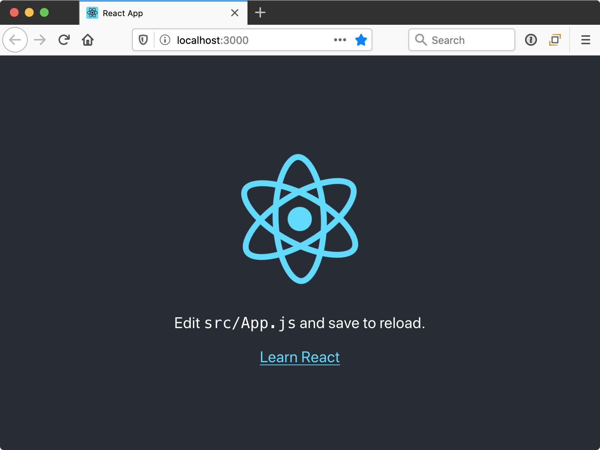
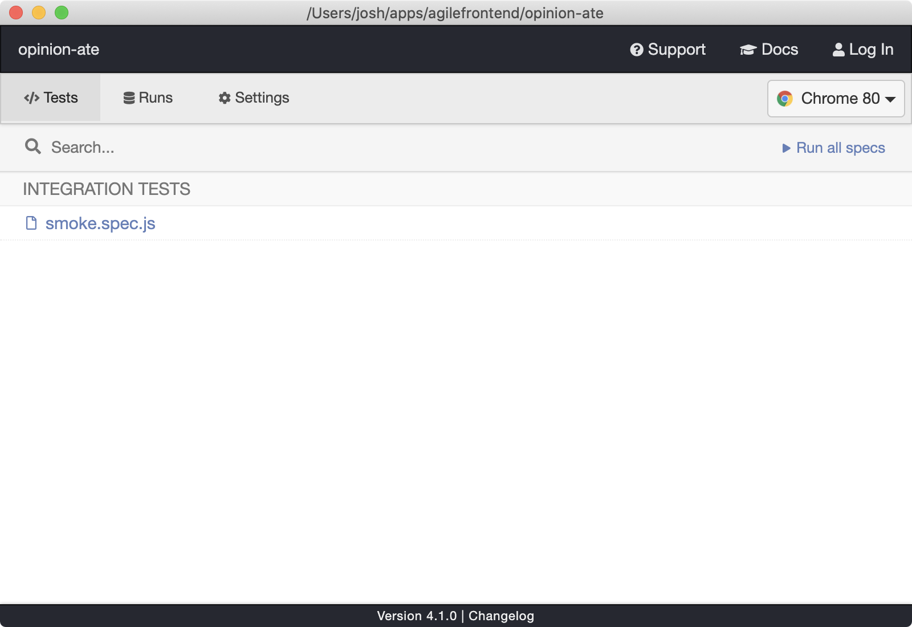
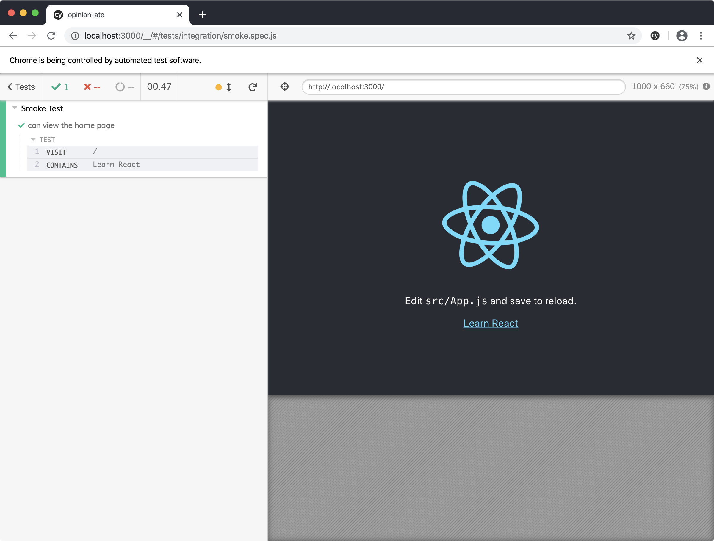
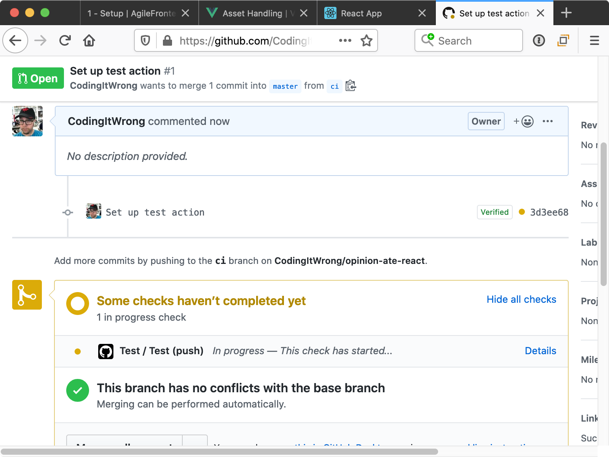
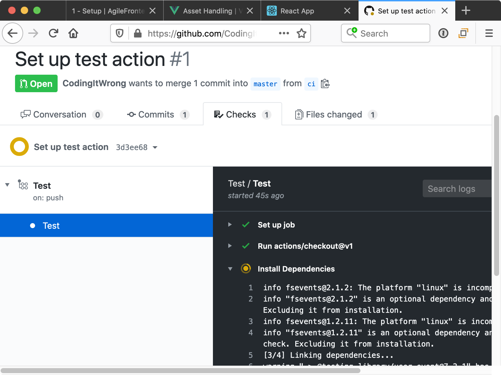
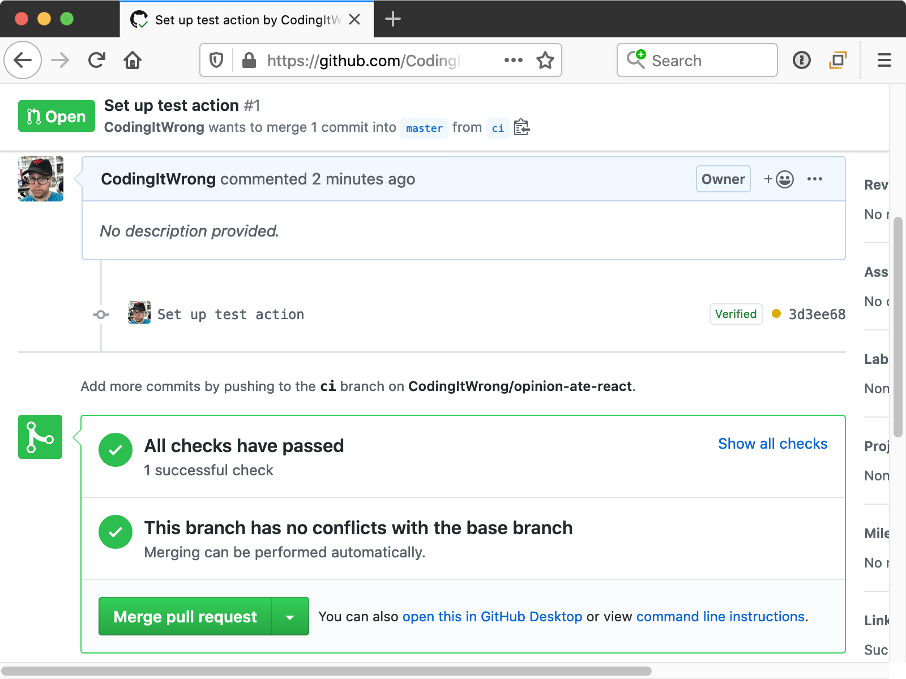

# 1 - Setup

In this first chapter, we'll set up our project and process. This won't involve writing any app-specific functionality. Instead, what we'll do is:

- Make a list of our stories to work on
- Get our development machine dependencies installed
- Get React installed and running
- Get linting and autoformatting working
- Get E2E and component tests running
- Get our tests running on CI
- Get our application automatically deploying to a hosting service

That's a lot, but we want to get it in place before we write our first line of production code to ensure we have support in place for our agile process. And it won't take too long because we'll use powerful tools to help us get there. Once that's all in place, we'll be ready to start implementing our application's features.

## Planning Our Work
Before we start our work, we want a way to track it. Let's use Trello.

* Set Up Development Environment
* Create App
* Set up Autoformatting
* Set Up Tests On CI
* Set Up Automatic Deployment
* Fill In Readme
* List Restaurants
* Style App with Material Design
* Show Loading and Error States
* Add Restaurants

## Setting Up Development Environment
Here are the tools we'll need to install:

- Git
- Node
- Yarn
- An editor

### Node
We'll be using Create React App as our build tool. Like most frontend build tools, it runs on top of [Node.js](https://nodejs.org/en/), so you’ll need node installed locally.

### Yarn
[Yarn](https://yarnpkg.com/) is an alternative `npm` client. Generally I find it to be faster, more predictable, and more reliable than using the default `npm` client. I use `yarn` for all my projects.

If you’d prefer to use `npm`, you can still follow this guide, you’ll just need to replace any `yarn` commands with the equivalent `npm` commands.

### An Editor

There are a number of different editors that are good for React development; two popular free ones are [Visual Studio Code](https://code.visualstudio.com/) and [Atom](https://atom.io/).

With this, we can mark off our first task in Trello:

- [x] Set Up Development Environment

## Creating the App
Create a new React app:

```sh
$ npx create-react-app opinion-ate
```

Create React App will start the installation process, and when it completes, your application will be created and ready to use.

Open your `package.json` and note the scripts we have available:

- `start` to run the app locally
- `build` to create a release build of the app
- `test` to run unit tests, including React component tests
- `eject` for if we ever want to move away from Create React App

Let's try it out. Run `yarn start`. Your app should automatically open in your default browser, with a spinning React logo.



In the console you'll see something like the following:

```
Compiled successfully!

You can now view opinion-ate in the browser.

  Local:            http://localhost:3000
  On Your Network:  http://10.0.1.7:3000

Note that the development build is not optimized.
To create a production build, use yarn build.
```

With this, we can mark off our next task in Trello:

- [x] Create App

Next, let's set up linting and autoformatting. Create React App includes a built-in ESLint config to check your code for issues while it runs. But we can set up a separate ESLint config that our editor can see, so it can warn us about issues right away and autoformat files upon save.

Add this rather lengthy list of packages:

```sh
$ yarn add --dev eslint \
                 eslint-config-prettier \
                 eslint-plugin-cypress \
                 eslint-plugin-import \
                 eslint-plugin-jest \
                 eslint-plugin-jsx-a11y \
                 eslint-plugin-prettier \
                 eslint-plugin-react \
                 prettier
```

Then create a file `.eslintrc.js` at the root of your project and add the following:

```js
module.exports = {
  extends: ['eslint:recommended', 'plugin:react/recommended', 'prettier'],
  plugins: ['prettier', 'jest', 'cypress'],
  parser: 'babel-eslint',
  env: {
    browser: true,
    'cypress/globals': true,
    es6: true,
    'jest/globals': true,
  },
  settings: {
    react: {
      version: 'detect',
    },
  },
  rules: {
    'prettier/prettier': 'error',
    'react/prop-types': 'off',
  },
};
```

And another file `.prettierrc.js` and add the following:

```js
module.exports = {
  bracketSpacing: false,
  singleQuote: true,
  trailingComma: 'all',
};
```

Now, set up ESLint integration with your editor. For example:

- Atom: [linter-eslint](https://atom.io/packages/linter-eslint)
- VS Code: [ESLint extension](https://marketplace.visualstudio.com/items?itemName=dbaeumer.vscode-eslint)

After enabling this integration, open `App.test.js`. Notice warnings on line 2 and 6 inside the curly brackets: Prettier is suggesting removing the spaces inside the curlies. If you've enabled autoformatting on save, which I recommend, when you save the file those spaces will be removed automatically.

Let's go ahead and commit these configuration changes to linting and formatting. Small, focused commits make it easier for other developers to review, and keep us accountable to really understanding what is changing in our code. Create React App initializes our app with a git repo, so we can just add the changes:

```sh
$ git add .
$ git commit -m "Set up linting and autoformatting"
```

With this, we can mark off our next task in Trello:

- [x] Set up autoformatting

Next, let’s confirm our tests work. Open `src/App.test.js`. Note that it’s testing the `App` component. Now run `yarn test`. You may get a note "No tests found related to files changed since last commit." If so, press a to run all tests.

 You should see the following:

```
PASS  src/App.test.js
 ✓ renders learn react link (32ms)

Test Suites: 1 passed, 1 total
Tests:       1 passed, 1 total
Snapshots:   0 total
Time:        1.816s
Ran all test suites.

Watch Usage: Press w to show more.
```

Press ctrl-C to leave the test runner.

Now we need to install Cypress for end-to-end tests. Run:

```sh
$ yarn add --dev cypress
```

When it completes, in your `package.json`, add a new script:

```diff
 "scripts": {
   "start": "react-scripts start",
   "build": "react-scripts build",
   "test": "react-scripts test",
+  "cypress": "cypress open",
   "eject": "react-scripts eject"
 }
```

Now run that command:

```sh
$ yarn cypress
```

A Cypress window will open, with a modal that says "To help you get started", informing us Cypress created some sample files. Click "OK, got it!"

Now let's tweak these files. In the root of your project should be a `cypress.json` file. Open it and replace the contents with:

```json
{
  "baseUrl": "http://localhost:3000"
}
```

This configures Cypress to treat all URLs from the root of our local React app.

Now, open the `cypress/integration` folder Cypress created, and see that there is an `examples` child folder under it. Delete the `examples` folder with its child test files. In its place, create a file `cypress/integration/smoke.spec.js` and add the following contents:

```js
describe('Smoke Test', () => {
  it('can view the home page', () => {
    cy.visit('/');
    cy.contains('Learn React');
  });
});
```

This test will load up the root of our app and confirm it can see the text "Learn React" on it.

Now, back in the Cypress window, you should see the list updated to only contain our `smoke.spec.js` test.



Click on `smoke.spec.js`. A new instance of Chrome will open and you’ll see the Cypress test runner interface. On the left is our “Smoke Test” and a series of steps, which should pass. On the right is our app.



Add the Cypress tests to git:

```sh
$ git add .
$ git commit -m "Set up Cypress E2E tests"
```

## Continuous Integration
When Create React App creates our project, it initializes a git repo and adds our code to it. Let’s push it up to GitHub. Create a new GitHub repo and add it as the `origin` remote. Push up the repo:

```sh
$ git remote add origin https://github.com/your-user-name/your-repo-name.git
$ git push --set-upstream origin master
```

In many development approaches, the next thing we would do would be to start building application functionality. We might go ahead and release. Later we might decide to try to add testing and continuous integration.

We’re going to go the opposite route in this guide. We’re going to set up CI and deployment from the very start.

There are a number of great CI services, including:

* [Travis CI](https://travis-ci.com/)
* [CircleCI](https://circleci.com/)
* [GitHub Actions](https://github.com/features/actions)

We're going to go with GitHub Actions due to the fact that it's already set up in your GitHub repo.

Let’s set this up in a pull request to the mirror the usual approach you’ll take. Create a new `ci` branch:

```sh
$ git checkout -b ci
```

In your project, create a `.github/workflows` folder, create a `test.yml` file, and add the following contents:

```yml
name: Test
on: [push]

jobs:
  unit-test:
    name: Test
    runs-on: ubuntu-16.04
    steps:
      - uses: actions/checkout@v1
      - name: Install Dependencies
        run: yarn install
      - name: Unit Tests
        run: yarn test --watchAll=false
      - name: E2E Tests
        uses: cypress-io/github-action@v1
        with:
          start: yarn start
          wait-on: 'http://localhost:3000'
```

Commit the file then push up your changes to GitHub:

```sh
$ git add .
$ git commit -m "Set up test action"
$ git push -u origin ci
```

GitHub will give you a URL to create a pull request. Open it in the browser, and click “Create pull request”.

Notice the yellow “Some checks haven't completed yet” warning, with “Test/Test” under it. That’s our GitHub Action running.



Click the “Details” link next to it. You’ll see our unit and E2E tests running.



When they pass, the action will be marked as passed. If you go back to the Conversation tab of your PR, you’ll see a green “All checks have passed”.



Go ahead and click “Merge pull request”, then “Confirm merge”, then "Delete branch".

In your local project, switch back to `master` and pull down the latest changes that we merged in from the branch:

```sh
$ git checkout master
$ git pull
```

With this, we can mark off our next task in Trello:

- [x] Set Up Tests On CI

## Deployment
Next we're going to go ahead and deploy our application to production. Yes, even though it doesn't do anything yet!

First let's see how a production build works locally. Run `yarn build`. The files are written to a `build` folder in your project. Open it and see static assets including HTML, JS, and CSS files. Due to the way the file paths work, you can’t just open the HTML file in the browser, but they’ll work when deployed to a server.

There are many ways to deploy frontend apps. One easy one is services like Netlify that are set up to run your frontend build process for you. Netlify has a free Starter plan for individual users.

Create a Netlify account from [Netlify’s Sign Up page](https://app.netlify.com/signup). Since we will need to give it access to GitHub anyway, it might make sense to sign up with your GitHub account.

Once you’re signed in, click "New site from Git”. Click the “GitHub” button. A list of all your repos will appear. Search for your repo and click it. Leave “Branch to deploy” as `master`. Under “Basic build settings”, you should see “Build command” pre-populated to `yarn build`, and `build/` for the "Publish directory". Netlify has automatically detected that we're using Create React App and entered the settings for us. This means that Netlify will run that command, then take the files in that directory and deploy them. That’s all we need to configure, so click “Deploy site”.

You will be sent to the Overview page for your new site. In yellow you’ll see “Site deploy in progress”. Click that text and you’ll be taken to the Deploys page. In a list at the bottom you’ll see “Production: master@HEAD Building”—click that. You’ll see a console log of output as the site is being built. Eventually you’ll see:

```
6:53:02 AM: Site is live
6:53:52 AM: Finished processing build request in 2m5.053946316s
```

(Your timestamps will be different depending on how unreasonably early you wake up.)

Click “< Deploys" to go back to the Deploys tab. If you waited for the deployment to complete, at the top in green you’ll see the name of your site, with an automatically-assigned set of nonsense words and characters. (For example, mine is `https://xenodochial-aryabhata-5985da.netlify.com`.) Click the green link in your browser. You should get the Learn React page.

Now let’s rename that site to be a bit easier to remember. Go back to Netlify, then click the Overview tab, then “Site settings” button. Under General > Site details > Site information, click “Change site name”. Enter anything you like and click Save. At the top of this screen, under “Settings for”, your site URL appears in gray. Click on it to confirm your new domain works.

We're now set to run our app's tests on CI and deploy to production. We had a little setup to do, but the defaults provided by Create React App, GitHub Actions, and Netlify went a long way toward simplifying the process.

With this, we can mark off our next task in Trello:

- [x] Set Up Automatic Deployment

## Filling In the Readme
Writing down helpful information to help future developers (including yourself) work on the app is important. Open `README.md` and see what Create React App created for us by default. It’s a fairly minimal readme that lists the NPM scripts available, as well as links to learn more about Create React App. If these commands weren’t in here, I would recommend that we add them: how to run, build, and test.

Let’s add a description of the project and link to production, filling in your Netlify domain:

```diff
+# opinion-ate
+
+An app for tracking reviews of dishes at different restaurants.
+
+Production: https://your-netlify-domain.netlify.com/
+
 This project was bootstrapped with [Create React App](https://github.com/facebook/create-react-app).
```

Also, if someone uses `npm` instead of `yarn` they won’t get the right dependencies. Let’s make a note about this:

```diff
 Production: https://your-netlify-domain.netlify.com/
+
+Dependencies are locked with a `yarn.lock` file, so please use `yarn` and not `npm` for installing them.

 This project was bootstrapped with [Create React App](https://github.com/facebook/create-react-app).
```

Commit these README changes to git.

With this, we can mark off our next task in Trello:

- [x] Fill In Readme

Now all our setup is done and we are ready to work on our first feature!
